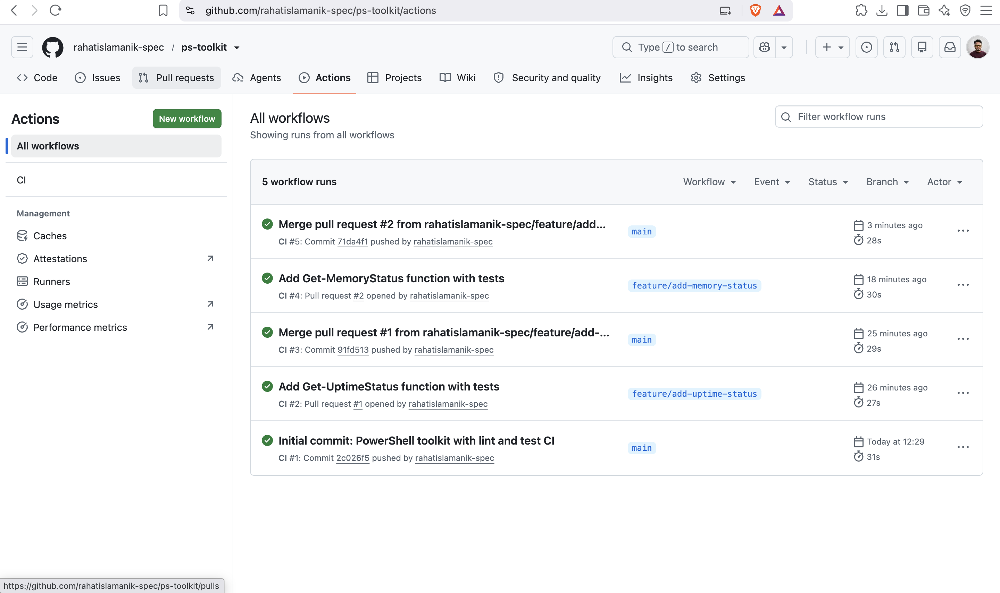
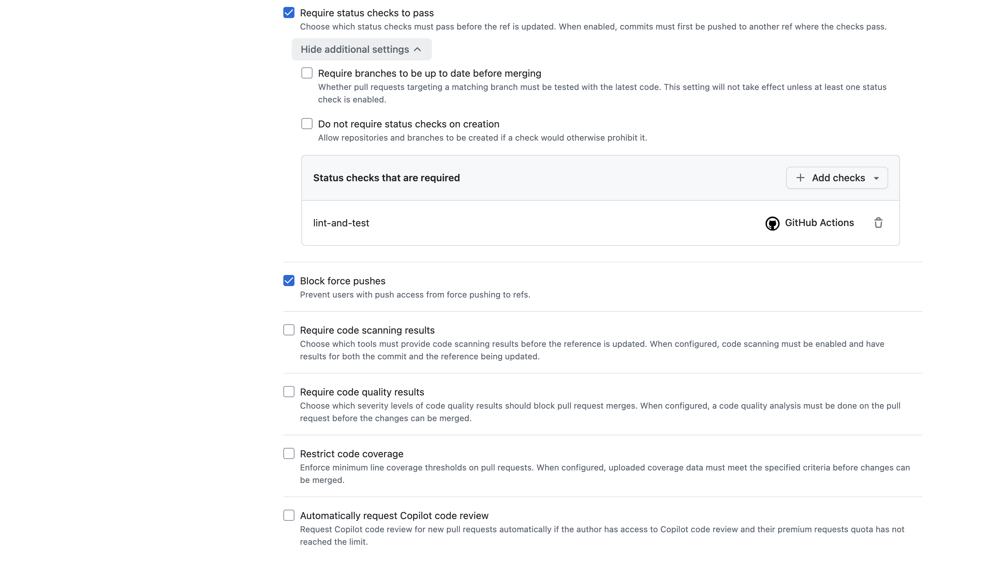
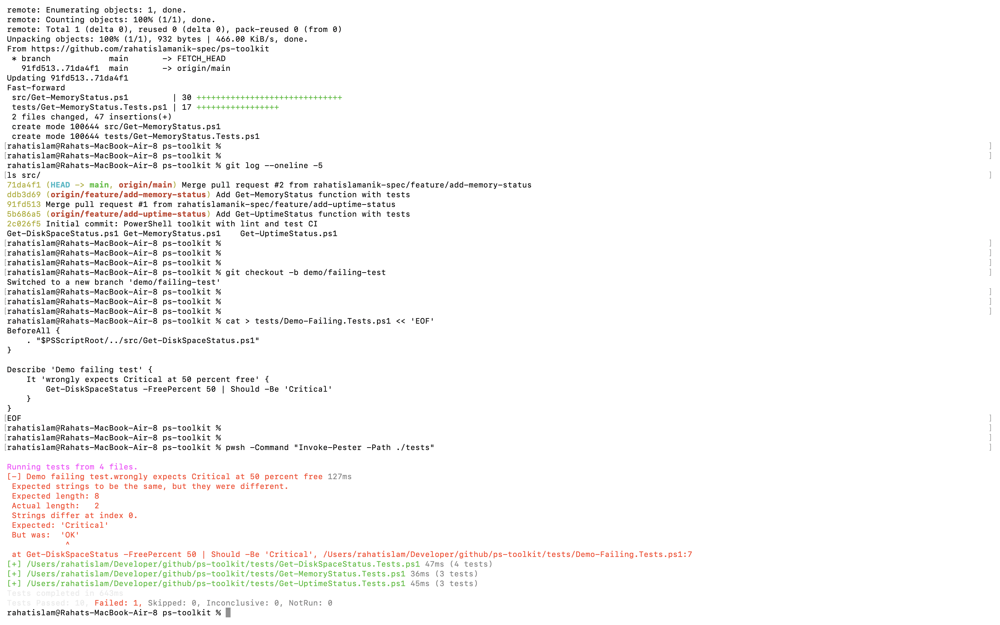
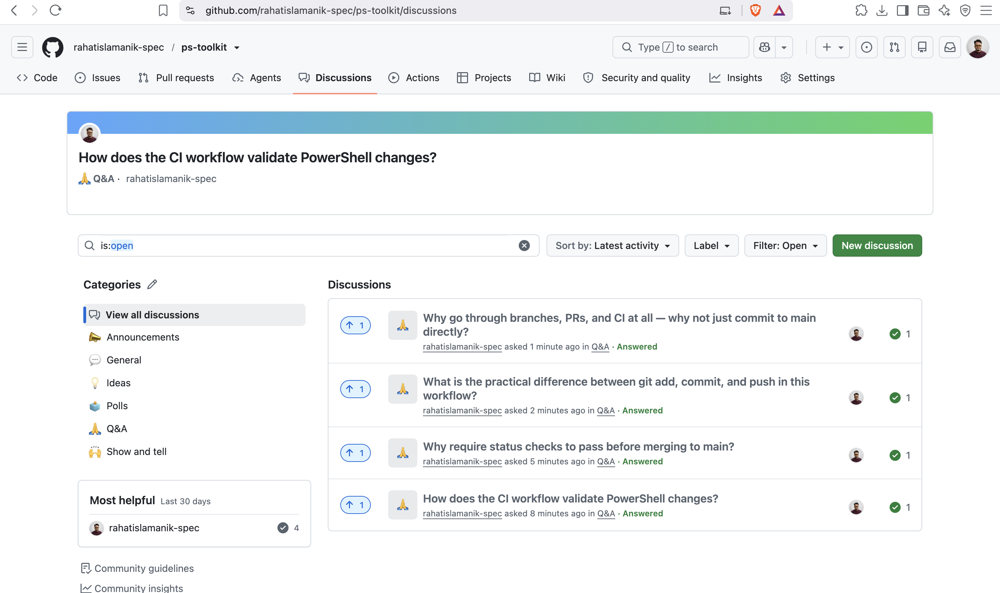

# PS Toolkit — Enterprise Git & CI/CD Workflow Demonstration

> **⚠️ Practice / learning repository.** This repo exists to demonstrate a production-style Git and GitHub Actions workflow end-to-end. The PowerShell functions are small, read-only, and deliberately simple so the focus stays on the *workflow*, not the code. Contains no real, work, or client data.

## Purpose

A hands-on demonstration of the contribution workflow used in professional, regulated engineering environments: feature branches, pull requests, automated CI (lint + tests), a deliberately-broken-then-fixed build, and branch protection that enforces the whole process on `main`.

It documents not just *that* the workflow runs, but *why* each control exists.

## What this repository demonstrates

| Capability | What it proves |
|------------|----------------|
| Local repo to remote push | Initialising a local repository and connecting it to a GitHub remote |
| Feature-branch workflow | Isolating every change on a `feature/*` branch; never committing to `main` directly |
| Pull requests with descriptions | Communicating changes clearly (What / Why / How to verify) |
| CI/CD (GitHub Actions) | Automated PSScriptAnalyzer lint + Pester tests on every push and PR |
| Local test-first discipline | Running the test suite locally before pushing |
| Debugging a failed pipeline | Reading a failed check, diagnosing test-vs-code, and fixing it |
| Branch protection (rulesets) | Enforcing "PR required + CI must pass" so broken code cannot reach `main` |

## Repository structure

    ps-toolkit/
    ├── src/                      # Pure, testable PowerShell functions
    │   ├── Get-DiskSpaceStatus.ps1
    │   ├── Get-UptimeStatus.ps1
    │   └── Get-MemoryStatus.ps1
    ├── tests/                    # Pester unit tests (one file per function)
    ├── .github/workflows/ci.yml  # CI: lint + test on every push/PR
    └── docs/images/              # Evidence screenshots

Each function is a **pure function** — input in, output out, no system calls — which makes it deterministic and trivial to unit-test. This mirrors a real design principle: separate testable logic from side effects.

## The workflow, step by step

1. **Branch** off an up-to-date `main`
2. **Change** code and add/adjust tests
3. **Test locally** (`Invoke-Pester`) — catch failures before pushing
4. **Commit** with a clear, imperative message
5. **Push** the branch and **open a Pull Request** with a structured description
6. **CI runs** — PSScriptAnalyzer lint + Pester tests on a clean runner
7. **Merge** only once CI is green (enforced by branch protection)
8. **Clean up** — delete the branch, sync local `main`

## Evidence

### CI pipeline: every push and PR runs green

### Branch protection: a passing CI check is required to merge

### Debugging a failed test (and a clean commit history)
A test with an incorrect assertion was introduced deliberately, caught by the local test run, and diagnosed — the *test* expectation was wrong, not the function. The top of the same view shows the linear commit history of reviewed, merged PRs.

## Key lessons captured

- **Commit vs. push:** a commit saves a snapshot *locally*; a push sends it to the *remote*. Work is invisible to the team until pushed.
- **Why CI when tests pass locally:** local testing is a personal check; CI re-runs on a *clean machine, automatically, for every change* — and, with branch protection, it *gates* the merge. "Works on my machine" is not proof.
- **A red check isn't always your code's fault:** sometimes the test's expectation is wrong. The skill is reasoning about which side is correct.
- **Branch protection turns discipline into enforcement:** the process no longer depends on anyone remembering — the rule makes it structural.

## Tooling

PowerShell · Pester · PSScriptAnalyzer · GitHub Actions · GitHub Rulesets

### Q&A documentation via GitHub Discussions
The repository's Discussions tab hosts a Q&A knowledge base explaining the workflow — how CI validates changes, why status checks are required, the difference between add/commit/push, and why the branch/PR/CI model exists. Each question has an accepted answer.

